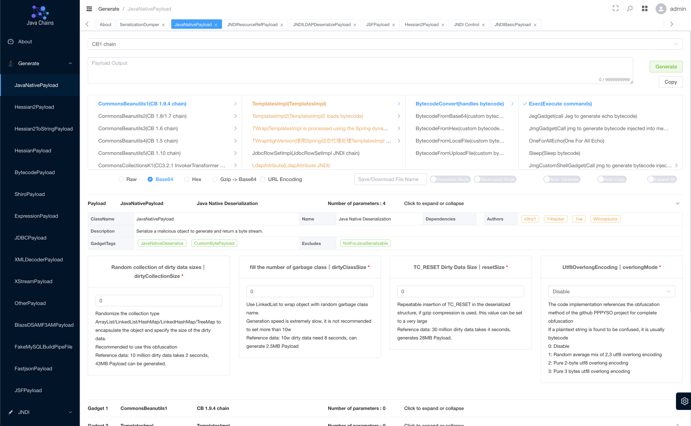

<h4 align="right">English | <strong><a href="./docs/zh-cn/README.md">简体中文</a></strong></h4>
<h1 align="center">Java Chains</h1>
<div align="center">


<a href="https://discord.gg/ukC8KTrRXv">
  
</a>

<div align="center">
    
</div>
</div>

`Java-Chains` is a Java payload generation platform for security researchers. Its web interface supports common Java payload generation and JNDI, FakeMySQL, and JRMP testing.

> Standing on the shoulders of giants

<p align="center">
  
</p>

## Quick start

Docs: https://java-chains.github.io/en/docs/guide

Plugin development reference: https://github.com/Java-Chains/chains-plugin-demo

### Docker Compose

```bash
# Extract the release package and place its chains-config directory next to docker-compose.yml
# If chains-config is empty, the container will start but cannot access the image's bundled configuration and plugins
docker compose up -d
# After startup, find the login credentials on the "Auth" line in the logs
docker logs -f java-chains | grep -i auth
```

Open `http://your-ip:8011`

### Docker run

| Port | Purpose |
| --- | --- |
| `8011` | Web interface |
| `58080` | JNDI HTTP service |
| `50389` | JNDI LDAP service |
| `50388` | JNDI RMI service |
| `3308` | FakeMySQL service |
| `13999` | JRMP Listener service |
| `50000` | HTTP service |
| `11527` | TCP service |

```bash
docker run -d \
  --name java-chains \
  --restart=unless-stopped \
  -p 8011:8011 \
  -p 58080:58080 \
  -p 50389:50389 \
  -p 50388:50388 \
  -p 3308:3308 \
  -p 13999:13999 \
  -p 50000:50000 \
  -p 11527:11527 \
  -e CHAINS_AUTH=true \
  -e CHAINS_PASS= \
  javachains/javachains:2.0.0-beta7
```

Empty `CHAINS_PASS` → a random password is generated at startup (see the `Auth` line in logs).  
`CHAINS_AUTH=false` also requires `CHAINS_ALLOW_AUTH_DISABLED=true` (explicit acknowledgement).

### Jar

Requires **OpenJDK / Temurin / Zulu JDK 8** (Oracle JDK 8 is not recommended for BCEL chains).

```bash
tar -xzf java-chains-2.0.0-beta7.tar.gz
cd java-chains-2.0.0-beta7   # or unpack layout with java-chains.jar + chains-config/
java -jar java-chains.jar
```

## References and acknowledgments

For personal research and learning only. Never use for illegal activity.

The developers, providers and maintainers are not responsible for actions or consequences of using this tool; users assume all risk.

Acknowledgments:

- https://github.com/ReaJason/MemShellParty
- https://github.com/wh1t3p1g/ysomap
- https://github.com/qi4L/JYso
- https://github.com/X1r0z/JNDIMap
- https://github.com/Whoopsunix/PPPYSO
- https://github.com/jar-analyzer/class-obf
- https://github.com/4ra1n/mysql-fake-server
- https://github.com/mbechler/marshalsec
- https://github.com/frohoff/ysoserial
- https://github.com/H4cking2theGate/ysogate
- https://github.com/Bl0omZ/JNDIEXP
- https://github.com/kezibei/Urldns
- https://github.com/rebeyond/JNDInjector
- https://github.dev/LxxxSec/CTF-Java-Gadget
- https://github.com/pen4uin/java-memshell-generator
- https://github.com/pen4uin/java-echo-generator
- https://github.com/NickstaDB/SerializationDumper
- https://xz.aliyun.com/t/5381
- http://rui0.cn/archives/1408

## Communication

If you have any questions, please open an issue or join [Discord](https://discord.gg/ukC8KTrRXv).

## Star History

[](https://star-history.dera.page/#vulhub/java-chains&Date)
