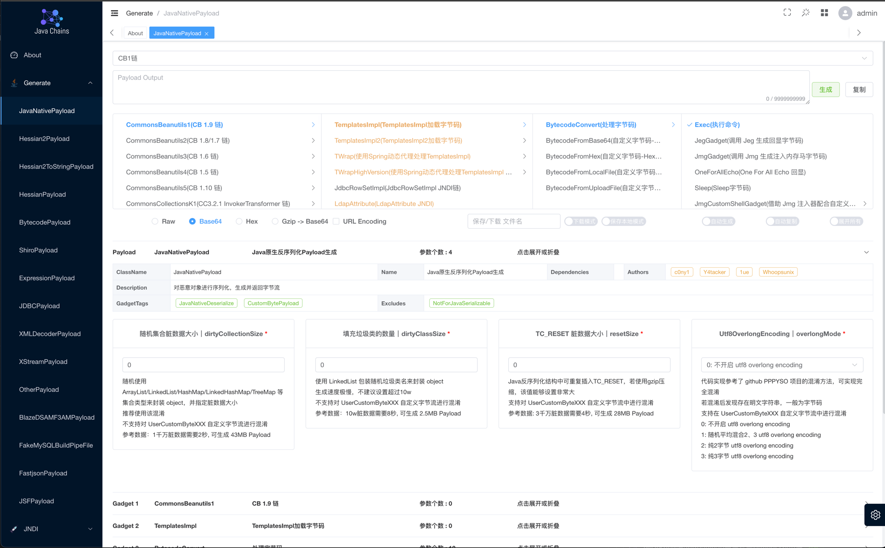

<h4 align="right"><strong><a href="../../README.md">English</a></strong> | 简体中文</h4>
<h1 align="center">Java Chains</h1>
<div align="center">


<a href="https://discord.gg/ukC8KTrRXv">
  
</a>

<div align="center">
    
</div>
</div>

`Java-Chains` 是面向安全研究员的 Java Payload 生成平台，通过 Web 界面支持常见 Java Payload 生成，以及 JNDI、FakeMySQL 和 JRMP 测试。

> 站在巨人肩膀上

<p align="center">
  
</p>

## 快速开始

文档：https://java-chains.github.io/docs/guide

插件开发参考仓库：https://github.com/Java-Chains/chains-plugin-demo

### Docker Compose

```bash
# 建议先解压发布包，再将其中的 chains-config 文件夹放到 docker-compose.yml 所在目录
# 如果 chains-config 文件夹为空，容器仍能启动，但无法读取镜像中预置的配置和插件
docker compose up -d
# 启动后，可在日志的 "Auth" 行查看登录账号和密码
docker logs -f java-chains | grep -i auth
```

打开 `http://your-ip:8011`

### Docker run

| 端口 | 用途 |
| --- | --- |
| `8011` | Web 管理界面 |
| `58080` | JNDI HTTP 服务 |
| `50389` | JNDI LDAP 服务 |
| `50388` | JNDI RMI 服务 |
| `3308` | FakeMySQL 服务 |
| `13999` | JRMP Listener 服务 |
| `50000` | HTTP 服务 |
| `11527` | TCP 服务 |

```bash
docker run -d \
  --name java-chains \
  --restart=unless-stopped \
  -p 8011:8011 \
  -p 58080:58080 \
  -p 50389:50389 \
  -p 50388:50388 \
  -p 3308:3308 \
  -p 13999:13999 \
  -p 50000:50000 \
  -p 11527:11527 \
  -e CHAINS_AUTH=true \
  -e CHAINS_PASS= \
  javachains/javachains:2.0.0-beta7
```

`CHAINS_PASS` 为空时启动会随机生成密码，见日志中的 `Auth` 行。

`CHAINS_AUTH=false` 时还需显式设置 `CHAINS_ALLOW_AUTH_DISABLED=true`。

### Jar 启动

需要 **OpenJDK / Temurin / Zulu JDK 8**（Oracle JDK 8 不推荐，BCEL 相关链可能失败）。

```bash
tar -xzf java-chains-2.0.0-beta7.tar.gz
cd java-chains-2.0.0-beta7   # 或解压后目录内含 java-chains.jar + chains-config/
java -jar java-chains.jar
```

## 参考和致谢

仅支持个人研究学习，切勿用于非法犯罪活动。

本项目的开发者、提供者和维护者不对使用者使用工具的行为和后果负责，工具的使用者应自行承担风险。

参考致谢：

- https://github.com/ReaJason/MemShellParty
- https://github.com/wh1t3p1g/ysomap
- https://github.com/qi4L/JYso
- https://github.com/X1r0z/JNDIMap
- https://github.com/Whoopsunix/PPPYSO
- https://github.com/jar-analyzer/class-obf
- https://github.com/4ra1n/mysql-fake-server
- https://github.com/mbechler/marshalsec
- https://github.com/frohoff/ysoserial
- https://github.com/H4cking2theGate/ysogate
- https://github.com/Bl0omZ/JNDIEXP
- https://github.com/kezibei/Urldns
- https://github.com/rebeyond/JNDInjector
- https://github.dev/LxxxSec/CTF-Java-Gadget
- https://github.com/pen4uin/java-memshell-generator
- https://github.com/pen4uin/java-echo-generator
- https://github.com/NickstaDB/SerializationDumper
- https://xz.aliyun.com/t/5381
- http://rui0.cn/archives/1408

## 交流

有问题请开 Issue，或加入 [Discord](https://discord.gg/ukC8KTrRXv)。

## Star History

[](https://star-history.dera.page/#vulhub/java-chains&Date)
